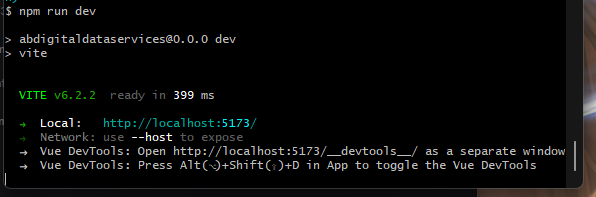

# AB Digital Data Services Website

AB Digital Data Services Website Setup

## Recommended IDE Setup

[VSCode](https://code.visualstudio.com/) + [Volar](https://marketplace.visualstudio.com/items?itemName=Vue.volar) (and disable Vetur).

## Customize configuration

See [Vite Configuration Reference](https://vite.dev/config/).

## Project Setup

- Ensure git is installed. [Git for Windows](https://git-scm.com/install/windows)
- Ensure VSCode is installed. [VSCode](https://code.visualstudio.com/)
- Ensure Node is installed. [Node.js](https://nodejs.org/en/download)
- Near the bottom, choose the Windows Installer.msi
- After Node is installed, open a git bash terminal and clone this repo to the folder you want.
- (Right click in an explorer window and select Git Bash)
```sh
git clone https://github.com/kalegar/abdigitaldataservices.git
```
- Afterwards, run the following command in git bash
```sh
npm install
```

- Finally, to get started developing, run the following command in the project folder to start VSCode:
```sh
code .
```

### Compile and Hot-Reload for Development
To run the site locally while developing, run:
```sh
npm run dev
```
You should see something like this:


### Compile and Minify for Production
When ready to build for production:
```sh
npm run build
```

### Lint with [ESLint](https://eslint.org/)

```sh
npm run lint
```
